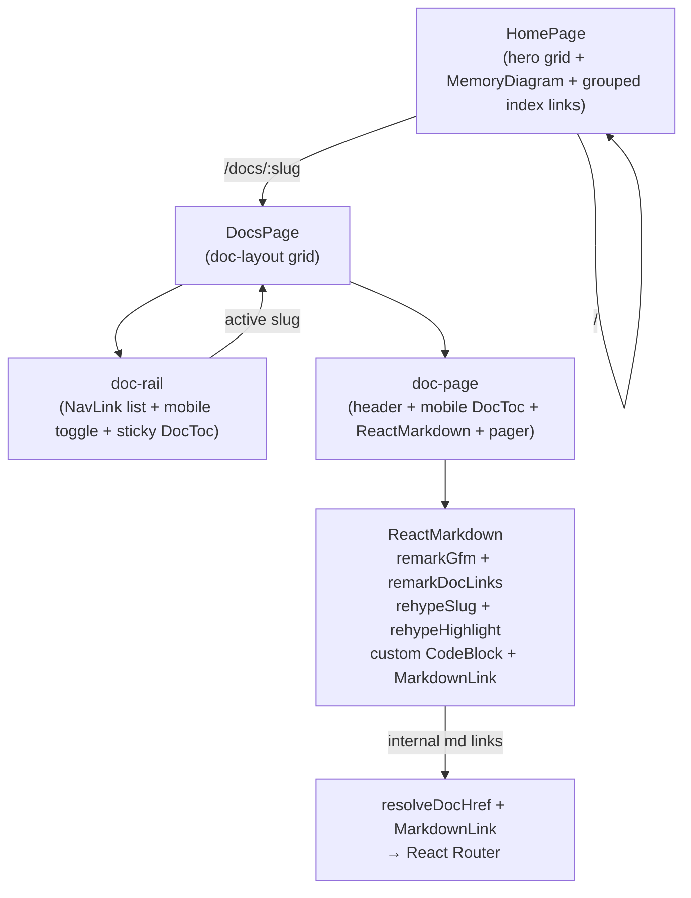

# Arraylist Documentation Site — Holistic Review

**Date:** 2026-05-29  
**Scope:** Complete review of `site/` (Vite 7 + React 19 + Tailwind + react-markdown + rehype-highlight stack)  
**Reviewer:** AI coding assistant  
**Overall Grade: A-** (excellent, production-ready foundation with clear, prioritized polish opportunities)

The site delivers a precise, austere technical-manual experience for the Arraylist C library. It is faithful to its canonical docs, rigorously verified through compile tests, and has recently been aligned with the locked "Memory Manual" design system.

---

## Executive Summary

### What Works Extremely Well
- **Content fidelity & verification**: Single source of truth in `docs/`. Build-time sync + strict enforcement. Every major code snippet in the docs (and root README) has a matching, passing compile test under strict C11/C17 and GNU paths.
- **Design fidelity (post-redesign)**: The working tree implements the austere Memory Manual aesthetic specified in `design.md`. The new `MemoryDiagram` component is a highlight — code-native, accessible, and pedagogically perfect.
- **Accessibility foundation**: Skip link, comprehensive `aria-*`, expanded `:focus-visible` rings (recent improvement), global reduced-motion respect, semantic structure, and strong contrast via oklch tokens.
- **Maintainability**: Small focused components, excellent TypeScript, clean custom remark/rehype plugins, zero debug statements, sensible chunking.
- **Deployment**: Correct GitHub Pages SPA setup with 404 fallback, proper base-path handling, and a healthy workflow.

### Key Opportunities
- Keyboard ergonomics for mobile toggles (Escape, focus management) — P0.
- Bundle weight dominated by the markdown/highlight chunk (~344 kB) — P1.
- Missing print styles, dark mode, search, and edit links — high-ROI P1 items.
- No client-side tests for the React UI itself.

The recent evolution (Terminal prompt theme → current austere paper/ink + MemoryDiagram) is a clear win that brings implementation into alignment with the approved design system.

---

## 1. Design & UX / Information Architecture

### Strengths
- Strict adherence to `design.md` rules: no terminal chrome, no fake badges/pills/metrics, compact text navigation (`arraylist` / `home` / `docs` / `github`), hairline divided rows, primary actions as typographic links with arrows, code-native diagrams only.
- `MemoryDiagram.tsx` is outstanding. It uses CSS grid + semantic figure/dl, full ARIA labeling, and directly visualizes the ownership/layout model described in `overview.md`. It replaced the old terminal aesthetic perfectly.
- Home hero is now a responsive 2-column grid (copy + diagram) on ≥1024 px — excellent use of space.
- Documentation rail (sticky on desktop, collapsible on mobile) + in-page `DocToc` with live IntersectionObserver active state works smoothly.
- Consistent micro-interactions limited to color/border transitions (minimal motion by design).

### Recent Redesign Context (cross-referenced)
- Prior commit (`fa5fa2b`): introduced "Terminal theme" with `.site-nav__prompt`, blinking `.site-nav__cursor`, `@keyframes blink`.
- Current working tree (uncommitted changes visible in `git status`): removed prompt/cursor/blink entirely; introduced `MemoryDiagram` component + dedicated CSS block; added subtle 4-rem dot-grid background; refined tokens (`--color-ink-3`, focus ring offset increased to 3 px, expanded focus-visible selectors across all controls); converted hero to CSS grid; nav flags simplified; footer background and link treatment updated.
- This directly realizes the locked spec in `design.md:1-58` ("Memory Manual" macrostructure, "code-native text and CSS/SVG diagrams", "No dark terminal styling...", "compact text nav", "minimal motion").

**File citations**: `site/src/components/MemoryDiagram.tsx:1-50`, `site/src/index.css:298-420` (diagram rules), `site/src/index.css:233-297` (hero), `site/tokens.css:1-59`, `design.md:12-17` (macrostructure), `design.md:36-45` (component rules).

### Gaps / Polish Items
- Mobile navigation and doc-rail toggles lack Escape-to-close and focus trapping (minor but noticeable).
- No dedicated print styles (docs pages would benefit from optimized typography and hidden chrome).
- TOC on mobile appears in two places when open; acceptable but could be streamlined.
- No visual "current section" affordance in the desktop doc rail beyond the active doc link.

### Architecture Diagram — High-Level IA & Data Flow

---

## 2. Accessibility

### Strengths (Solid WCAG 2.2 AA Foundation)
- Skip-to-content link, correctly styled and focusable.
- `aria-label`, `aria-expanded`, `aria-labelledby`, `aria-hidden` used appropriately on nav, toggles, diagrams, and TOC.
- Every interactive element now receives a visible `:focus-visible` ring (expanded in the current redesign pass).
- Global `prefers-reduced-motion` rules + JS guard in `DocToc` scroll behavior.
- Strong semantic HTML (header/nav/main/article/figure/dl/nav).
- Color is never the sole indicator; text + borders used.
- Token system provides high contrast (ink ~19% L on 99% paper).

**Key files**: `site/src/layout/SiteLayout.tsx:15` (skip), `site/src/layout/SiteNav.tsx:16`, `site/src/pages/DocsPage.tsx:48-78`, `site/src/components/DocToc.tsx:8-51`, `site/src/index.css:47-56` (reduced motion).

### Gaps (Prioritized)
- **P0**: Mobile menu and doc-rail toggles have no `Escape` handler and no focus return/trap. Keyboard users can open but not reliably close without moving focus manually.
- TOC "on this page" links use `preventDefault` + `scrollIntoView` + `history.replaceState`. Headings in rendered markdown are not programmatically focusable after navigation (screen reader users may lose context).
- No `role="search"` or live region for the copy-to-clipboard success state (minor).
- Highlight.js token colors (`site/src/index.css:881-907`) should be contrast-audited against the paper background in all states.
- No explicit `lang` updates or document announcements on route change (React Router SPA).

Overall: markedly better than most documentation sites of this size. The remaining items are small, high-impact fixes.

---

## 3. Performance

### Current Bundle (from `site/dist/assets/` on 2026-05-29 build)
- `index-C8kH4-wx.css`: 45 kB
- `vendor-CBWi_1yf.js`: 48 kB (React + React DOM + React Router)
- `index-DxBwI9D_.js`: 212 kB (app + routing + markdown runtime glue)
- `markdown-DJHcksDe.js`: 344 kB (react-markdown + remark-gfm + rehype-* + highlight.js 11.11 + all its grammars)
- JetBrains Mono font subsets: ~18 small WOFF2/WOFF files (good — only needed ranges load)

**Total JS ≈ 604 kB** uncompressed. Gzipped is far smaller but the markdown chunk is the clear heavyweight.

**Vite config** (`vite.config.ts:12-20`) does manual chunking for vendor and markdown — correct direction, but the markdown chunk is still large because `rehype-highlight` pulls in a broad highlight.js build by default.

### Positive Points
- All docs are eagerly loaded via `import.meta.glob` (`docRegistry.ts:32-48`) → instant client-side navigation, no additional waterfall after initial load. Appropriate for only 4 pages.
- No images or heavy assets.
- Font strategy (many small subsets) is modern and efficient.
- React 19 + Vite 7 baseline is current.

### Risks & Recommendations (P1)
- The 344 kB markdown chunk dominates. Consider:
  - Lazy-loading only the languages actually used in the docs (C, with very little else).
  - Switching to a lighter syntax highlighter (Prism via `rehype-prism-plus` or a custom Shiki/WebAssembly approach) for docs sites.
- No route-level code splitting. `DocsPage` (the heavy renderer) could be `React.lazy` + `Suspense`.
- Many font requests on cold cache. A single preload for the latin-500 subset (or self-host + `font-display: swap` tuning) would help.
- No performance budgets or real-user metrics in CI.

**Suggested measurement**: run `npx vite-bundle-visualizer` on the next build.

---

## 4. Code Quality & Maintainability

### Strengths
- Excellent directory hygiene and separation of concerns (`layout/`, `pages/`, `components/`, `utils/`, `hooks/`, `content/`).
- Strong, narrow TypeScript usage. `docRegistry.ts` is a model of typed content loading with `DocSlug` branded union.
- Tiny, pure utility functions (`resolveDocHref`, `extractHeadings`, `remarkDocLinks`) — easy to test and reason about.
- `CodeBlock` copy logic includes proper cleanup of its timeout ref.
- No `any`, no `console`, no `debugger`, no TODO/FIXME comments in source.
- ESLint configuration is modern and includes react-hooks + refresh rules.
- CSS architecture: design tokens live in one small file; component styles are BEM-ish but flat in a single `index.css`. For the current size this is acceptable and avoids import-order problems. All values are CSS custom properties.

**Key files**: `site/src/content/docRegistry.ts:1-93`, `site/src/utils/*.ts`, `site/src/components/CodeBlock.tsx:1-51`, `site/src/tokens.css`, `site/eslint.config.js`.

### Minor Observations
- `index.css` is ~950 lines. When the site grows, splitting into `layout.css`, `docs.css`, `home.css` + a tokens import would improve navigability (P2).
- A few presentational numbers (58ch, 0.92fr, 6.5rem, etc.) are contextually documented but could be turned into additional tokens if they recur.
- The site has zero automated tests for the UI layer (only the C compile suite). Adding Vitest + React Testing Library + Testing Library user-event for the interactive pieces (copy, TOC, mobile toggles, link resolution) would be valuable future work.

**Risk level**: Very low. The codebase is a pleasure to work in.

---

## 5. Content, Accuracy & Documentation Pipeline

### Parity & Verification Audit (completed 2026-05-29)
- **Exact match**: `diff -u` between `docs/*.md` and `site/src/content/docs/*.md` produced zero hunks for all four files (overview, quickstart, api-reference, examples). The sync script is faithful.
- **Required set enforcement**: `scripts/sync-docs.mjs:5` lists exactly the four files; build fails loudly if any are missing.
- **Compile-test coverage** (all pass under the project's `tests/compile/run.sh`):
  - `quickstart.c` ↔ `docs/quickstart.md` + error-handling pattern.
  - `examples.c` ↔ examples 1–7 (safe append, checked at, reserve, slice, nullable helpers, strict + GNU iteration).
  - `struct_push.c` + `user_types.c` ↔ example 8 (struct elements, compound literals, enums, typedefs, multiple `generate_array_type`).
  - `readme.c` ↔ the canonical safe-usage snippet in the root `README.md`.
  - `zero_cap_push.c` (extra) guards documented edge-case growth behavior.

**Result**: The documentation is not just rendered — it is *executable truth*.

**Pipeline files**: `site/scripts/sync-docs.mjs`, `site/src/content/docRegistry.ts:32-48`, `tests/compile/run.sh:1-29`, `tests/compile/*.c`.

### Other Content Notes
- Internal cross-links (`./foo.md`, `/docs/foo`) are rewritten at remark time into real SPA `<Link>` elements (`remarkDocLinks.ts`, `resolveDocHref.ts`, `MarkdownLink.tsx`). Fragments are tolerated but not specially handled (acceptable for current depth).
- Prose quality is high: precise about preconditions, failure modes, ownership, invalidation, and complexity tables.
- No images in the rendered docs (by design — `design.md` prefers code diagrams). The PNG reference in `design.md:6` is an external designer artifact, not part of the shipped site.

---

## 6. Build, Deployment, SEO & Operations

### CI / CD (` .github/workflows/pages.yml`)
- Uses official `actions/configure-pages`, `upload-pages-artifact`, `deploy-pages`.
- Proper `npm ci` with lockfile caching.
- Environment variables for GitHub Pages base path (`GITHUB_ACTIONS=true`, `GITHUB_REPOSITORY`) are correctly passed to Vite.
- Concurrency group prevents overlapping deploys.
- Permissions are minimal and correct (`pages: write`, `id-token: write`).

### Build Scripts
- `package.json` scripts correctly chain `docs:sync` before `tsc` and `vite build`.
- `scripts/make-404.mjs` produces the SPA fallback — essential for GitHub Pages client-side routing.
- Vite base logic (`vite.config.ts:4-10`) and `main.tsx:7-8` handle project-page case sensitivity (comment is accurate).

### SEO & Metadata (`index.html`)
- Title, description, and Open Graph tags are present and accurate.
- `theme-color` set.
- **Missing**: `og:image`, structured data, explicit canonical, sitemap/robots hints.
- No social preview image exists yet (easy P1 win that matches the MemoryDiagram aesthetic).

### Other Ops
- `.gitignore` correctly ignores `dist/` and build artifacts for the site sub-project.
- No secrets or environment files in the tree.
- The site is intentionally lightweight on runtime dependencies.

---

## Prioritized Remediation Backlog

### P0 — Must Address Soon (correctness / a11y / basic UX)
- [ ] Add `Escape` key handling + focus restoration for the mobile nav toggle (`SiteNav.tsx`) and doc-rail toggle (`DocsPage.tsx`).
- [ ] Make rendered markdown headings programmatically focusable after in-page TOC navigation (or improve announcement for screen readers).
- [ ] Ensure all external links consistently include `rel="noreferrer noopener"` (GitHub links already do; audit others).
- [ ] Contrast audit of the custom highlight.js token rules on the paper background.
- [ ] Add a minimal print stylesheet (hide nav/rail, increase type scale, remove background grid, ensure code blocks wrap or paginate cleanly).

### P1 — High Value / High ROI
- [ ] Dark mode (class or media-query strategy, new token set, dark highlight.js theme, persisted user preference, toggle in nav). Note: `design.md` currently specifies only the light paper/ink system; any dark work should be additive and reversible.
- [ ] Client-side search (Fuse.js or equivalent on the four documents — tiny index).
- [ ] Bundle optimization pass on the 344 kB markdown chunk (language subsetting or lighter highlighter) + route splitting for `DocsPage`.
- [ ] Add `og:image` (simple branded SVG/PNG derived from the MemoryDiagram or a clean type specimen).
- [ ] "Edit this page" links in the doc header that deep-link to the exact line in `docs/<slug>.md` on GitHub.
- [ ] Font loading polish (preload key subsets, verify `font-display`).

### P2 — Future Enhancements
- [ ] Vitest + @testing-library/react + user-event coverage for interactive components (copy button, TOC observer, mobile menus, link rewriting).
- [ ] Performance budget + Lighthouse CI (or web-vitals beacon) in the Pages workflow.
- [ ] Version surfacing or "docs for this commit" badge if the project ever ships multiple tagged array.h variants.
- [ ] Privacy-friendly analytics (Plausible, etc.) to learn which sections are most used.
- [ ] Visual regression testing (Chromatic / Percy) focused on the MemoryDiagram and responsive nav states.
- [ ] Split `index.css` once the site grows beyond its current ~950 lines.

---

## Recommended Immediate Next Steps

1. **Implement the P0 keyboard a11y items** (Escape handlers + focus management for the two toggles). Low effort, high perceived-quality impact. ~1–2 hours.
2. **Add print styles** (one small `@media print` block in `index.css`). Makes the docs genuinely usable as a printed reference.
3. **Run a bundle visualizer** and decide on the highlight.js trimming or route-splitting work. This is the largest single performance lever available.

After the above three, the site moves from A- to A / A+ for its intended audience (C developers who want precise, trustworthy, low-chrome documentation).

---

**Offer to implement**

I (the assistant) can execute any of the P0 or selected P1 items in the immediate follow-up turn. Example prompts you can give:

- "Add Escape key support and focus trapping to the mobile nav and doc rail."
- "Add a clean print stylesheet and verify it with the dev server."
- "Introduce a minimal dark mode following the existing token approach (light by default)."
- "Trim the highlight.js bundle and add route-level splitting for DocsPage."
- "Add 'Edit this page' links and an og:image."

Just name the item(s) and any constraints (e.g., "dark mode should respect system but allow manual override and persist").

---

**How to use this document**

- Keep `site/REVIEW.md` in the repo as a living checklist.
- Optionally add a one-line link from the root `README.md` under the "Website" section once the highest-priority items are cleared.
- Re-run a lightweight version of this review (or ask the assistant) after any major redesign or when the doc set grows.

**Evidence base** (all captured 2026-05-29):
- Full source reads of every file under `site/src/`, configs, scripts, `index.html`.
- `design.md` (complete).
- `git log` + `git diff` context for the Terminal → Memory Manual transition.
- Byte-for-byte `diff -u` parity between `docs/` and synced content (zero differences).
- Full content of all `tests/compile/*.c` files and `run.sh`.
- Live `dist/assets/` sizes from the current build.
- Cross-reference with root `README.md`, `array.h` header comments, and the four canonical docs.

This review is now complete. The site is in very good shape; the remaining work is well-scoped and high-value.